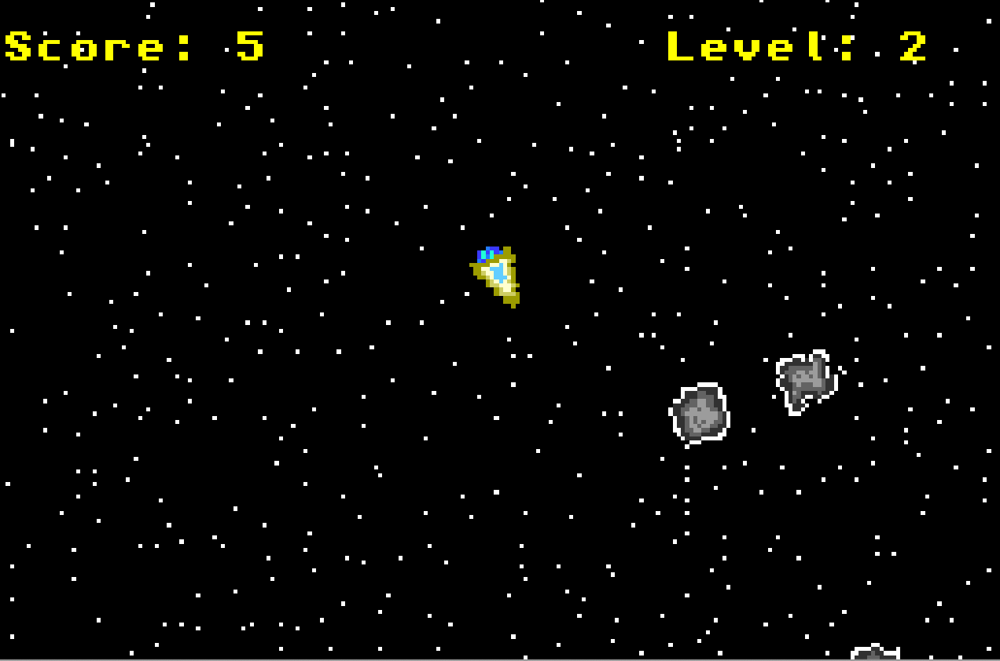

# GBA Asteroids

This is a Asteroids-like game for the Gameboy Advance.
You try to shoot and dodge asteroids the
get increasingly more common.



## Building

This build requires [devkitpro](https://devkitpro.org/wiki/Getting_Started).

On mac devkitpro can be installed via the `pkg` distribution:

```sh
sudo installer -pkg /path/to/devkitpro-pacman-installer.pkg -target /opt/devkitpro
```

Afterwards `devkitARM` can be installed:

```sh
pacman -S gba-dev
```

Additionally the following environment variables should be set:

```sh
export DEVKITPRO="/opt/devkitpro"
export DEVKITARM="/opt/devkitpro/devkitARM"
```

## Notes:

- `VBlankIntrWait()` will wait until vblank and only wait again after one execution, so this can be used for timing